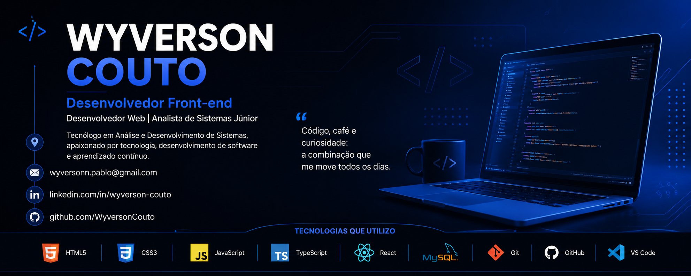

<!-- ========================================================= -->

<!--                GITHUB PROFILE - WYVERSON COUTO            -->

<!-- ========================================================= -->

  

<h1 align="center">Olá 👋, eu sou Wyverson Couto</h1>

<h3 align="center">
💻 Desenvolvedor Front-end • 🎓 Tecnólogo em ADS • 🚀 Em busca da primeira oportunidade em TI
</h3>

  

  

---

# 👨‍💻 Sobre mim

🎓 Tecnólogo em **Análise e Desenvolvimento de Sistemas**

📍 Araraquara - SP

💼 Atualmente atuando na área de monitoramento eletrônico e realizando transição para Desenvolvimento de Software.

🚀 Apaixonado por tecnologia, desenvolvimento web, aprendizado contínuo e resolução de problemas.

---

# 🛠 Tecnologias

---

# 📚 Atualmente estudando

* React
* TypeScript
* JavaScript ES6+
* Git e GitHub
* APIs REST
* Boas práticas de desenvolvimento
* Responsividade
* Estruturação de projetos Front-end

---

# 📂 Projetos em desenvolvimento

| Projeto                     |         Status        | Tecnologias           |
| --------------------------- | :-------------------: | --------------------- |
| 💻 Sistema de Cadastro      | 🚧 Em desenvolvimento | HTML, CSS, JavaScript |
| 🌐 Portfólio Profissional   |       ⏳ Em breve      | HTML, CSS, JavaScript |
| 📝 Lista de Tarefas         |       ⏳ Em breve      | JavaScript            |
| 📊 Dashboard Administrativo |       ⏳ Em breve      | HTML, CSS, JS         |
| ⚛ React App                 |       ⏳ Em breve      | React                 |
| 🎨 Landing Page Responsiva  |       ⏳ Em breve      | HTML, CSS             |

---

# 📈 Estatísticas

---

# 🔥 Sequência de Contribuições

---

# 📊 Gráfico de Atividades

---

# 🏆 Conquistas

---

# 🎯 Objetivos para 2026

* ✅ Conquistar minha primeira oportunidade como Desenvolvedor Front-end.
* ✅ Dominar React e TypeScript.
* ✅ Construir um portfólio sólido com projetos práticos.
* ✅ Aprimorar conhecimentos em Git, GitHub e APIs REST.
* ✅ Evoluir continuamente como profissional de tecnologia.

---

# 🌎 Idiomas

🇧🇷 Português — Nativo

🇺🇸 Inglês — Intermediário

🇪🇸 Espanhol — Intermediário

---

# 📫 Vamos nos conectar?

---

⭐ Obrigado por visitar meu perfil!

*"A tecnologia transforma ideias em soluções. Estou construindo essa jornada um projeto de cada vez."*

