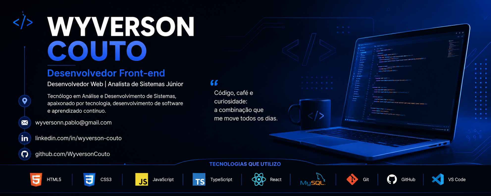

<!-- ========================================================= -->
<!--                GITHUB PROFILE - WYVERSON COUTO            -->
<!-- ========================================================= -->

  

<h1 align="center">Olá 👋, eu sou Wyverson Couto</h1>

<h3 align="center">
💻 Desenvolvedor Front-end • 🎓 Tecnólogo em ADS • 🚀 Em busca da primeira oportunidade em TI
</h3>

  

  

---

# 👨‍💻 Sobre mim

🎓 Tecnólogo em **Análise e Desenvolvimento de Sistemas**

📍 Araraquara - SP

💼 Atualmente atuando na área de monitoramento eletrônico e realizando transição para Desenvolvimento de Software.

🚀 Apaixonado por tecnologia, desenvolvimento web, aprendizado contínuo e resolução de problemas.

---

# 🛠 Tecnologias

  
  
  

---

# 📚 Atualmente estudando

* React e TypeScript
* JavaScript ES6+
* Git e GitHub
* APIs REST
* Responsividade e boas práticas de Front-end
* Automação de processos com n8n e IA generativa
* Engenharia de dados com Databricks

---

# 📂 Projetos

> Clique no nome do projeto para abrir o repositório.

## 🌐 Front-end

| Projeto | Descrição | Tecnologias | Online |
| ------- | --------- | ----------- | ------ |
| [**Portfólio Profissional**](https://github.com/WyversonCouto/Portfolio) | Site com meus projetos pessoais | HTML, CSS, JavaScript | [Ver portfólio](https://wyversoncouto.github.io/Portfolio/) |
| [**Sistema de Pedidos — Hamburgueria**](https://github.com/WyversonCouto/sistema-pedidos-hamburgueria) | Cardápio digital com carrinho, cálculo automático do total e resumo do pedido em tempo real. Layout responsivo | HTML, CSS, JavaScript | [Fazer um pedido](https://wyversoncouto.github.io/sistema-pedidos-hamburgueria/) |

## 🤖 Automação e IA

| Projeto | Descrição | Tecnologias |
| ------- | --------- | ----------- |
| [**WY Assistant AI**](https://github.com/WyversonCouto/WY-Assistant-AI) 🚧 | Secretária virtual que responde mensagens, gerencia agenda e classifica contatos | n8n, Ollama, Docker, Google Calendar, Gmail, Telegram |
| [**Assistente de Investimentos com RPA e IA**](https://github.com/WyversonCouto/dio-lab-assistente-investimentos-rpa-n8n) | Workflow de automação com IA generativa e envio por e-mail (desafio DIO) | n8n, Groq, Gmail |
| [**Desafios Criativos**](https://github.com/WyversonCouto/meus-desafios-criativos) | Planejamento de automações com n8n usando bons prompts (desafio DIO) | n8n, Engenharia de prompts |

## 📊 Dados

| Projeto | Descrição | Tecnologias |
| ------- | --------- | ----------- |
| [**VoeBem Analytics**](https://github.com/WyversonCouto/voebem-analytics-databricks) | Pipeline de dados da aviação brasileira (ANAC) com arquitetura medalhão: Bronze, Silver, Gold e Genie (Imersão Alura) | Databricks, SQL, Python |

## 📘 Estudos

| Projeto | Descrição |
| ------- | --------- |
| [**Miniguia de Estudos Front-end**](https://github.com/WyversonCouto/miniguia-estudos-notebooklm) | Caderno temático no NotebookLM sobre como se tornar um desenvolvedor Front-end e ser contratado (desafio DIO) |

> 🚧 **Próximos projetos:** Lista de Tarefas (JavaScript), Dashboard Administrativo, Landing Page Responsiva e um app em React.

---

# 📈 Estatísticas

---

# 🔥 Sequência de Contribuições

---

# 🎓 Cursos, imersões e desafios

* 🧠 **Alura** — Imersão Engenharia de Dados com IA (projeto [VoeBem Analytics](https://github.com/WyversonCouto/voebem-analytics-databricks))
* 🚀 **DIO** — Desafio de projeto: Caderno Temático no NotebookLM ([miniguia](https://github.com/WyversonCouto/miniguia-estudos-notebooklm))
* 🚀 **DIO** — Desafio de projeto: Planejando Automações com n8n Usando Apenas Bons Prompts ([repositório](https://github.com/WyversonCouto/meus-desafios-criativos))
* 🚀 **DIO** — Desafio de projeto: Assistente de Investimentos com RPA e IA Generativa ([repositório](https://github.com/WyversonCouto/dio-lab-assistente-investimentos-rpa-n8n))

---

# 🎯 Objetivos para 2026

- [ ] Conquistar minha primeira oportunidade como Desenvolvedor Front-end
- [ ] Dominar React e TypeScript
- [ ] Construir um portfólio sólido com projetos práticos
- [ ] Aprimorar conhecimentos em Git, GitHub e APIs REST
- [ ] Evoluir continuamente como profissional de tecnologia

---

# 🌎 Idiomas

🗣️ **Português** — Nativo

🗣️ **Inglês** — Intermediário

🗣️ **Espanhol** — Intermediário

---

# 📫 Vamos nos conectar?

---

<picture align="center">
  <source media="(prefers-color-scheme: dark)" srcset="https://raw.githubusercontent.com/WyversonCouto/WyversonCouto/output/github-contribution-grid-snake-dark.svg">
  <source media="(prefers-color-scheme: light)" srcset="https://raw.githubusercontent.com/WyversonCouto/WyversonCouto/output/github-contribution-grid-snake.svg">
  
</picture>

⭐ Obrigado por visitar meu perfil!

*"A tecnologia transforma ideias em soluções. Estou construindo essa jornada um projeto de cada vez."*

